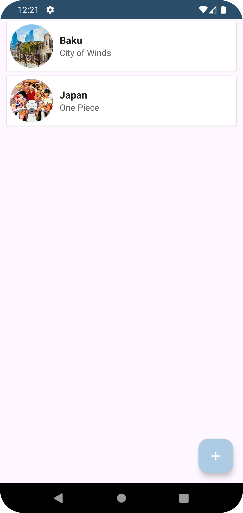
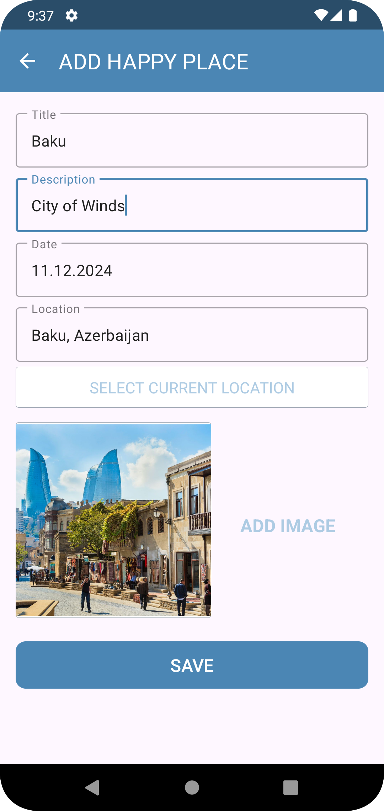
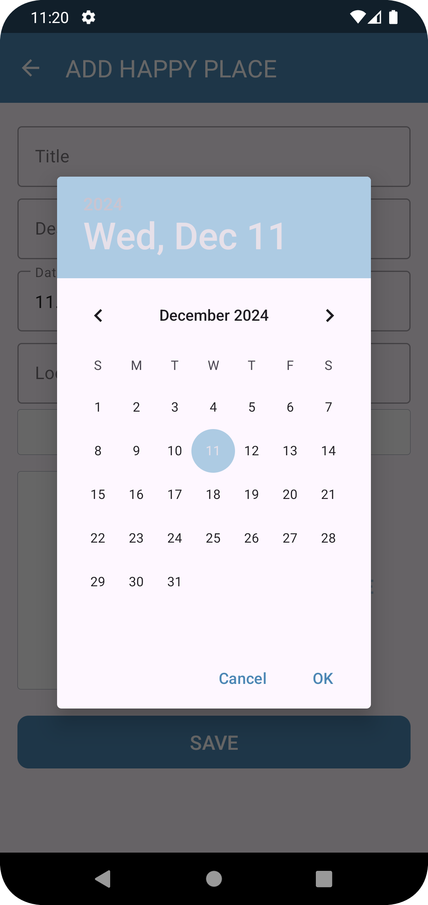
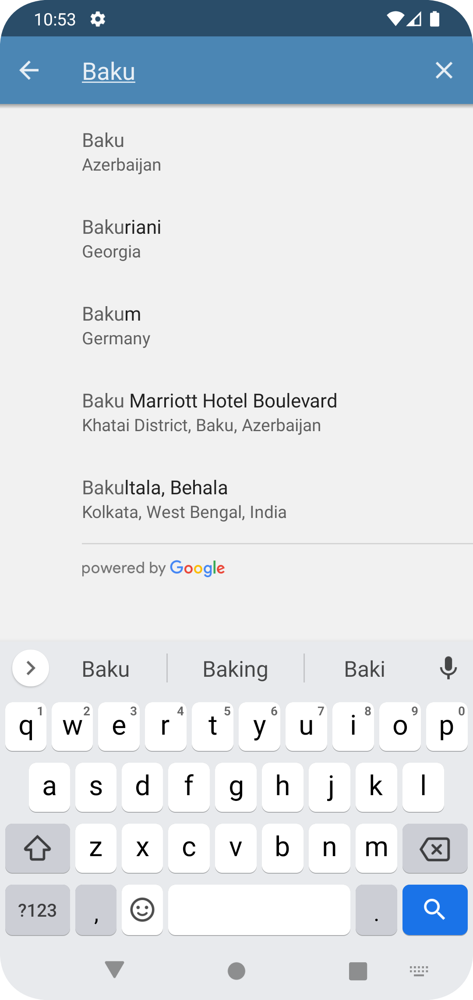
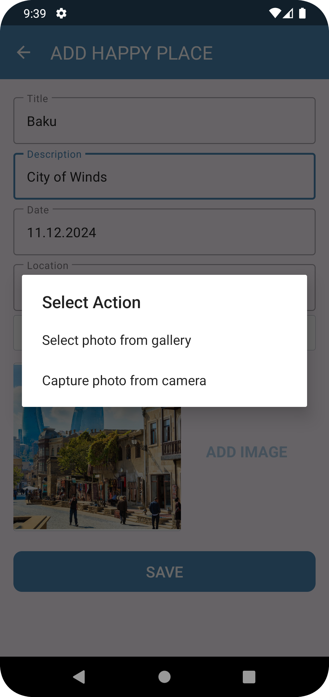
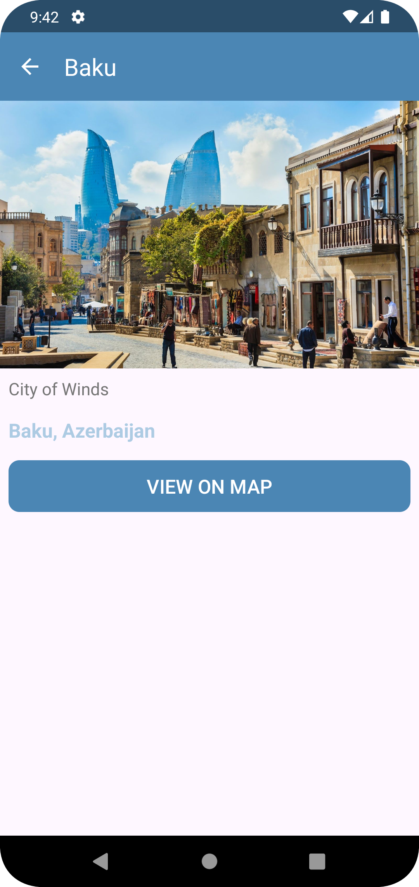
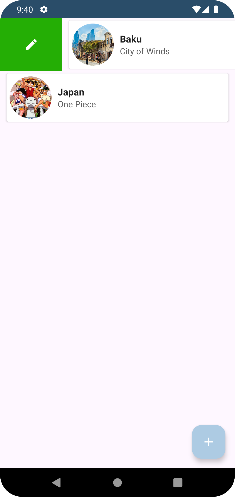
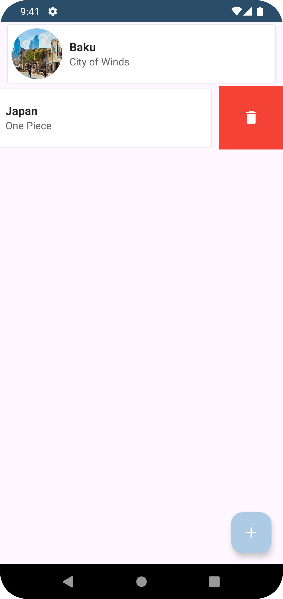
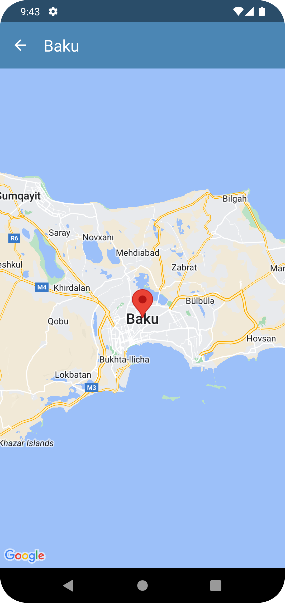

# Setup Instructions

### 1. Getting Started

Clone the Repository and Copy the provided `gradle.properties.template` to a new file named `gradle.properties`:

   ```bash
   git clone https://github.com/elismailov/happy-places.git
   cd happy-places
   cp gradle.properties.template gradle.properties
   ```
### 2. **Obtain Your Google Maps API Key**

1. Go to the [Google Cloud Console](https://console.cloud.google.com/).
2. Sign in with your Google account, or create one if you don't have it.
3. Create a new project or select an existing project in the top navigation bar.
4. In the left sidebar, navigate to **APIs & Services** > **Credentials**.
5. Click on **Create Credentials** and choose **API Key**.
6. Copy the generated API key.

### 3. **Add the API Key to the `gradle.properties` File**

1. Locate the `gradle.properties` file in the root directory.
2. Replace the placeholder value `MY_API_KEY=your_api_key_here` with your own API key.
3. Save the file.

### 4. **Ensure Required APIs Are Enabled**

To ensure the app functions correctly, make sure the following APIs are enabled in your Google Cloud project:

- **Maps SDK for Android**
- **Places API**

To check or enable these APIs:

1. Go to **APIs & Services** > **Dashboard** in the Google Cloud Console.
2. If these APIs aren't enabled, click on **Enable APIs and Services**.
3. Search for **Maps SDK for Android** and **Places API**, and enable them if they are not already enabled.

# Screenshots

<p align="center">
  
  &nbsp;
  
  &nbsp;
  
<br><br>
  
  &nbsp;
  
  &nbsp;
  
<br><br>
  
  &nbsp;
  
  &nbsp;
  
</p>